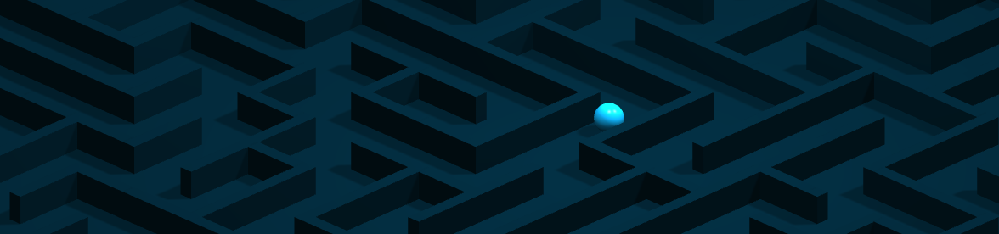
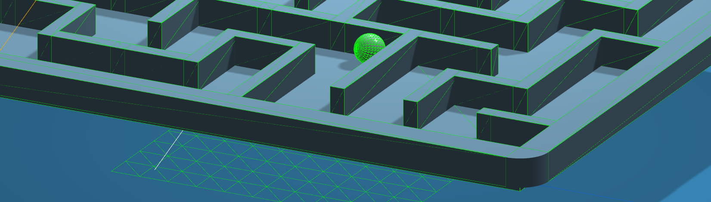

# Ball Maze Demo

This is a project I made to practice with js libraries, in this instance three.js and cannon-es.js.

### Features

-   WASD controls tilt the maze, allowing gravity to move the ball around in the maze
-   Refreshing the page generates a new unique maze that is solvable (it is possible for the ball to reach all parts of the maze)
-   Refreshing the page also randomizes the color of the background, maze, and ball

### Built with

-   HTML
-   CSS
-   [three.js](https://github.com/mrdoob/three.js/) for rendering and post processing
-   [cannon-es](https://github.com/pmndrs/cannon-es) for physics simulation
-   [tinycolor](https://github.com/bgrins/TinyColor) for color randomization and generation

### Links

-   View it [here!](https://arnh8.github.io/ball-maze-demo)

